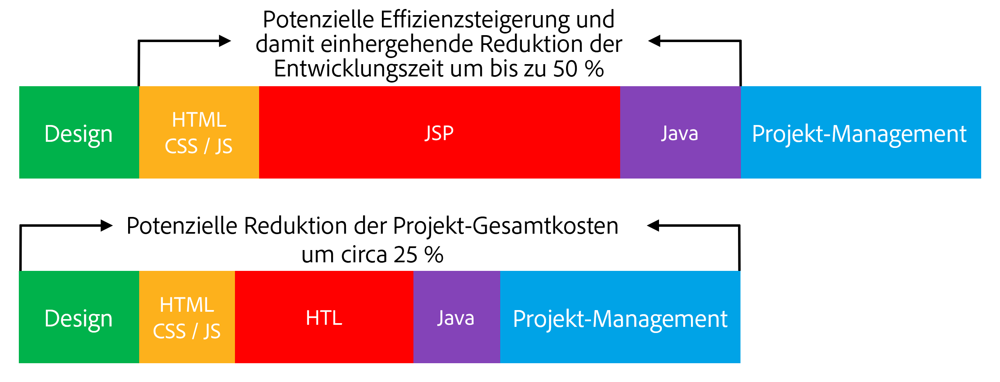

# Überblick {#overview}

Die HTML-Vorlagensprache (HTL), die durch Adobe Experience Manager (AEM) unterstützt wird, bietet ein hoch produktives Webframework auf Konzernebene, das die Sicherheit erhöht und es HTML-Entwicklern ohne Java-Kenntnissen ermöglicht, besser an AEM-Projekten teilhaben zu können.

Die HTML-Vorlagensprache wurde zusammen mit AEM 6.0 eingeführt und löst JSP (JavaServer Pages) als bevorzugtes und empfohlenes serverseitiges Vorlagensystem für HTML ab. Die HTML-Vorlagensprache unterstützt Webentwickler, die zuverlässige Konzernwebsites erstellen müssen, dabei, die Sicherheit und die Entwicklungseffizienz zu erhöhen.

## Erhöhte Sicherheit {#increased-security}

Die HTML-Vorlagensprache erhöht die Sicherheit der Sites, die sie in ihrer Implementierung verwenden, im Vergleich zu JSP und den meisten anderen Vorlagensystemen, da HTL automatisch die entsprechende kontextsensitive Maskierung auf alle Variablen anwenden kann, die der Präsentationsebene ausgegeben werden. HTL ermöglicht dies, da sie die HTML-Syntax versteht, und verwendet dieses Wissen zum Anpassen der erforderlichen Maskierung für Ausdrücke auf der Grundlage ihrer Position im Markup. Dies führt beispielsweise dazu, dass in `href`- oder `src`-Attributen platzierte Ausdrücke anders maskiert werden als Ausdrücke, die in anderen Attributen oder an anderer Stelle platziert werden.

Auch wenn dasselbe Ergebnis mit Vorlagensprachen wie JSP erzielt werden kann, muss dort der Entwickler manuell sicherstellen, dass jede Variable entsprechend maskiert wird. Da ein einzelner Wegfall oder Fehler hinsichtlich der angewendeten Maskierung potenziell ausreichen kann, um eine Sicherheitslücke beim Cross-Site-Scripting (XSS) zu verursachen, haben wir uns dafür entschieden, diese Aufgabe mit HTL zu automatisieren. Bei Bedarf können Entwickler weiterhin eine andere Maskierung für die Ausdrücke angeben. Mit HTL entspricht das Standardverhalten mit höherer Wahrscheinlichkeit dem gewünschten Verhalten, wobei die Fehlerwahrscheinlichkeit reduziert wird.

## Vereinfachte Bereitstellung  {#simplified-development}

Die HTML-Vorlagensprache lässt sich einfach erlernen und ihre Funktionen sind zweckgebunden, um sicherzustellen, dass sie einfach und gezielt bleibt. Sie verfügt über leistungsstarke Mechanismen für das Strukturieren von Markup und das Aufrufen der Logik. Zugleich erzwingt sie immer die strenge Trennung von Belangen zwischen Markup und Logik. Bei der HTL an sich handelt es sich um den Standard HTML5, da sie Ausdrücke und Datenattribute verwendet, um das Markup mit dem gewünschten dynamischen Verhalten mit Anmerkungen zu versehen. Sie unterbricht demnach nicht die Gültigkeit des Markups und sorgt dafür, dass es weiterhin lesbar bleibt. Beachten Sie, dass die Auswertung der Ausdrücke und Datenattribute vollständig serverseitig erfolgt und auf der Clientseite nicht sichtbar ist, wo jedes gewünschte JavaScript-Framework ohne Störung verwendet werden kann. 

Durch diese Funktionen können HTML-Entwickler ohne Java-Kenntnisse und nur mit geringen produktspezifischen Kenntnissen HTL-Vorlagen bearbeiten, wodurch sie Teil des Entwicklungsteams sein und die Zusammenarbeit mit den Java-Entwicklerexperten optimieren können. Zudem können sich Java-Entwickler wiederum auf den Back-End-Code konzentrieren und müssen sich nicht um HTML kümmern.

## Reduzierte Kosten  {#reduced-costs}

Erhöhte Sicherheit, vereinfachte Entwicklung und verbesserte Teamzusammenarbeit, in der Folge weniger Aufwand bei AEM-Projekten, schnellere Markteinführungszeiten (TTM) und niedrigere Gesamtbetriebskosten (TCO).

Konkret wurde bei der Neuimplementierung der Website Adobe.com mit der HTML-Vorlagensprache beobachtet, dass Kosten und Dauer des Projekts um etwa 25 % reduziert werden konnten.

Das obige Diagramm zeigt die folgenden, potenziell durch HTL ermöglichten Verbesserungen hinsichtlich der Effizienz:

* **HTML/CSS/JS:** Da die HTML-Entwickler HTL-Vorlagen direkt bearbeiten können, müssen die Front-End-Designs nicht mehr getrennt vom AEM-Projekt implementiert werden, sondern können direkt in den tatsächlichen AEM-Komponenten implementiert werden. Dies reduziert mühevolle wiederholte Durchgänge mit den Java-Entwicklerexperten.
* **JSP/HTL:** Da für HTL an sich keinerlei Java-Kenntnisse erforderlich sind und darin zu schreiben unkompliziert ist, kann jeder Entwickler mit HTML-Fachwissen die Vorlagen bearbeiten.
* **Java:** Dank der eindeutigen und einfach zu verwendenden durch HTL bereitgestellten Anwendungs-API ist die Schnittstelle mit der Geschäftslogik klarer gestaltet, wovon die Java-Entwicklung insgesamt profitiert.

**Lesen Sie als Nächstes:**

* [Erste Schritte mit der HTML-Vorlagensprache](getting-started.md)

