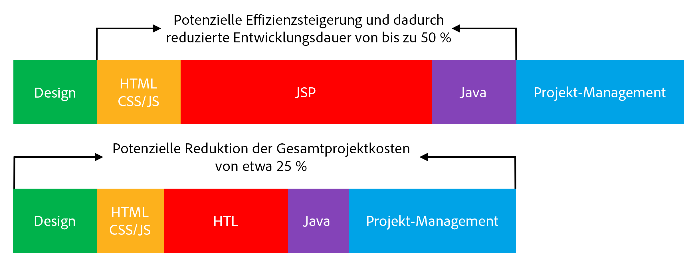

# Übersicht {#overview}

Die HTML-Vorlagensprache (HTL), die durch Adobe Experience Manager (AEM) unterstützt wird, bietet ein hoch produktives Webframework auf Unternehmensebene, das die Sicherheit erhöht und es HTML-Entwicklern ohne Java-Kenntnissen ermöglicht, besser an AEM-Projekten teilhaben zu können.

Die [in AEM 6.0 eingeführte](history.md) HTML Template Language ist das bevorzugte und empfohlene Server-seitige Vorlagensystem für HTML in AEM. Die HTML-Vorlagensprache unterstützt Web-Entwickler, die zuverlässige Unternehmens-Websites erstellen müssen, dabei, die Sicherheit und die Entwicklungseffizienz zu erhöhen.

## Erhöhte Sicherheit {#increased-security}

Die HTML Template Language erhöht die Sicherheit von Websites, die sie in ihrer Implementierung verwenden, im Vergleich zu den meisten anderen Template-Systemen, da HTL in der Lage ist, automatisch das richtige kontextbezogene Escaping auf alle Variablen anzuwenden, die an die Präsentationsebene ausgegeben werden. HTL ermöglicht dies, da sie die HTML-Syntax versteht, und verwendet dieses Wissen zum Anpassen des erforderlichen Escapings für Ausdrücke auf der Grundlage ihrer Position im Markup. Dies führt beispielsweise dazu, dass Ausdrücke, die in `href`- oder `src`-Attributen stehen, anders behandelt werden als Ausdrücke, die in anderen Attributen oder anderswo stehen.

Das gleiche Ergebnis kann mit Vorlagensprachen wie JSP erzielt werden. Der Entwickler muss jedoch manuell sicherstellen, dass die richtige Maskierung auf jede Variable angewendet wird. Da ein einziges Versäumnis oder Fehler beim angewendeten Maskieren möglicherweise ausreicht, um eine Sicherheitslücke beim Cross-Site-Scripting (XSS) zu verursachen, haben wir beschlossen, diese Aufgabe mit HTL zu automatisieren. Bei Bedarf können Entwickler für die Ausdrücke weiterhin eine andere Maskierung festlegen. Mit HTL entspricht das Standardverhalten jedoch mit viel höherer Wahrscheinlichkeit dem gewünschten Verhalten, wodurch die Wahrscheinlichkeit von Fehlern verringert wird.

## Vereinfachte Entwicklung {#simplified-development}

Die HTML-Vorlagensprache ist einfach zu erlernen und ihre Funktionen sind absichtlich begrenzt, um sicherzustellen, dass sie einfach und unkompliziert bleibt. Sie verfügt über leistungsstarke Mechanismen für das Strukturieren von Markup und das Aufrufen der Logik. Zugleich erzwingt sie immer die strenge Trennung von Belangen zwischen Markup und Logik. HTL selbst ist Standard-HTML5, da sie Ausdrücke und Datenattribute verwendet, um das Markup mit dem gewünschten dynamischen Verhalten zu kommentieren, was bedeutet, dass es die Gültigkeit des Markups nicht beschädigt und lesbar hält. Beachten Sie, dass die Auswertung der Ausdrücke und Datenattribute vollständig Server-seitig erfolgt und auf der Client-Seite nicht sichtbar ist, wo jedes gewünschte JavaScript-Framework ohne Störung verwendet werden kann. 

Diese Funktionen ermöglichen es HTML-Entwicklern ohne Java-Kenntnisse und mit wenig produktspezifischem Wissen, HTL-Vorlagen zu bearbeiten, sodass sie Teil des Entwicklungsteams sein können, und die Zusammenarbeit mit den Java-Entwicklern im Vollstapel zu optimieren. Umgekehrt ermöglicht dies es Java-Entwicklern, sich auf den Backend-Code zu konzentrieren, ohne sich um HTML zu sorgen.

## Reduzierte Kosten {#reduced-costs}

Erhöhte Sicherheit, vereinfachte Entwicklung und verbesserte Team-Zusammenarbeit führen bei AEM-Projekten zu geringerem Aufwand, schnellerer Markteinführung (TTM) und niedrigeren Gesamtbetriebskosten (TCO).

Konkret wurde bei der Neuimplementierung der Website Adobe.com mit der HTML-Vorlagensprache beobachtet, dass Kosten und Dauer des Projekts um etwa 25 % reduziert werden konnten.

Das obige Diagramm zeigt die folgenden, potenziell durch HTL ermöglichten Verbesserungen hinsichtlich der Effizienz:

* **HTML/CSS/JS:** Da die HTML-Entwickler in der Lage sind, HTL-Vorlagen direkt zu bearbeiten, müssen die Frontend-Designs nicht mehr getrennt vom AEM-Projekt implementiert werden, sondern können direkt auf den eigentlichen AEM-Komponenten implementiert werden. Dies reduziert schmerzhafte Iterationen mit den Java-Entwicklern im Vollstapel.
* **JSP/HTL:** Da HTL selbst kein Java-Wissen erfordert und direkt zu schreiben ist, ist jeder Entwickler mit HTML-Expertise berechtigt, die Vorlagen zu bearbeiten.
* **Java:** Dank der klaren und einfachen Anwendungs-API, die von HTL bereitgestellt wird, ist die Schnittstelle mit der Geschäftslogik klarer gestaltet, was auch der Java-Entwicklung insgesamt zugute kommt.

## Einführungsvideo {#video}

Das folgende Video aus einer [AEM Gems-Sitzung](https://experienceleague.adobe.com/docs/experience-manager-gems-events/gems/gems2014/aem-introduction-to-htl.html?lang=de) gibt einen Überblick über den Zweck von HTL sowie Implementierungsbeispiele.

>[!VIDEO](https://video.tv.adobe.com/v/19504/?quality=9)

Bitte beachten Sie, dass sich das Video auf HTL unter [seinem früheren Namen, Sightly](history.md), bezieht.

## Nächste Schritte {#next-steps}

Nachdem Sie nun die Ziele und Vorteile von HTL kennen, können Sie sich mit der Sprache vertraut machen, indem Sie das Dokument [Erste Schritte mit der HTML-Vorlagensprache](getting-started.md) lesen.
